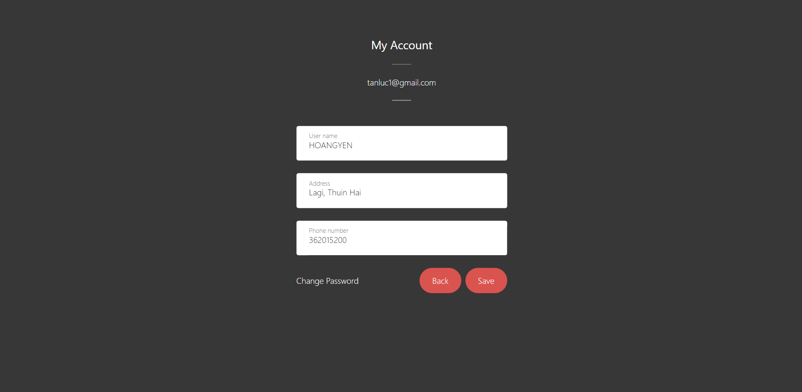

  

<h1 align="center"><b>LUDU STORE</h1>

<h2 align="center">FRUIT, FLOWER AND PACKAGING</h1>

 

### <b>Our Team:
- Trần Thế Duy (Davis)
- Bùi Nguyễn Tấn Lực (Luke)

 

### <b>The Stack
- Programming Language: Html, Php
- Database: MySQL
- Styling: Bootstrap & CSS

 

### <b>How to use:

<b>First, Create new database</b>  
- Open file Ludu/ludu.sql copy and paste on your localhost/phpadmin  
<b>Connect database (Mysql)</b>  
1. Open file Ludu/mysql/baglan.php  
2. Change your user and password  

 

### <b>Screenshots:
- HOME

 

- MENU

 

- PRODUCT

 

- INTRODUCE

 

- ABOUT US

 

- CART

 

- ORDER

 

- SIGN IN/UP

 

- CHANGE INFORMATION AND PASSWORD

 
